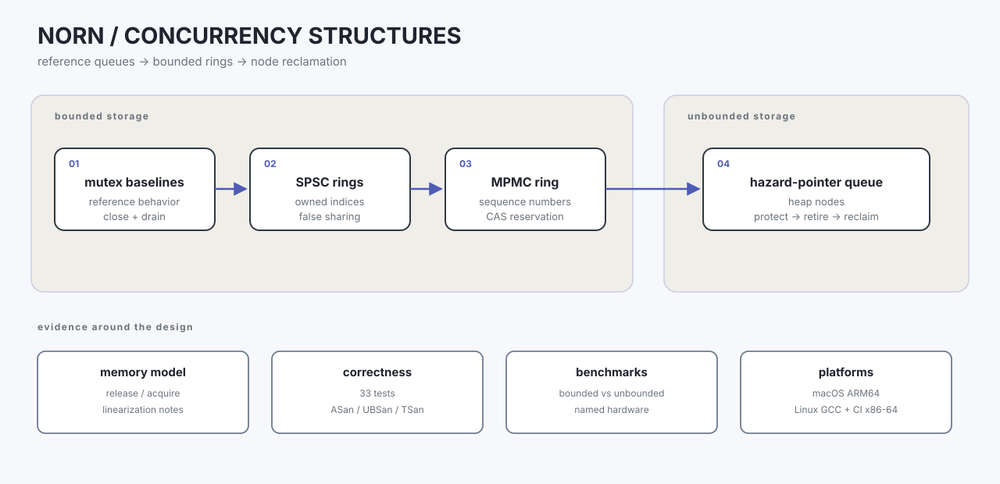
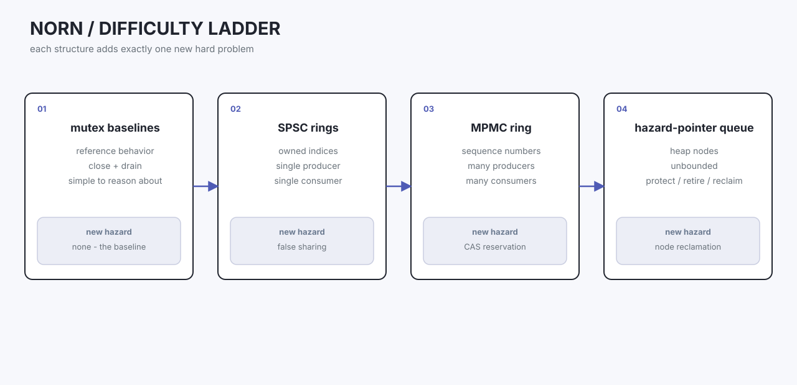
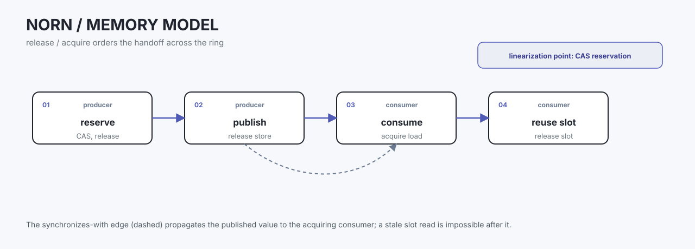
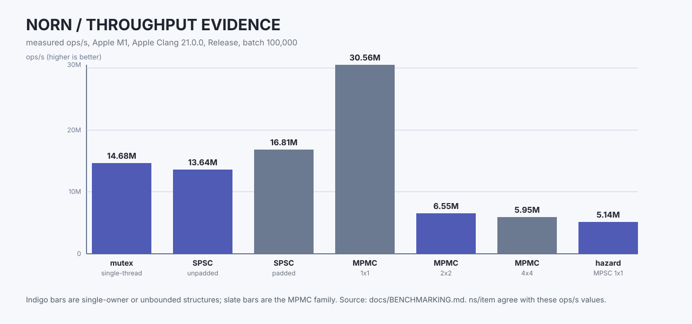
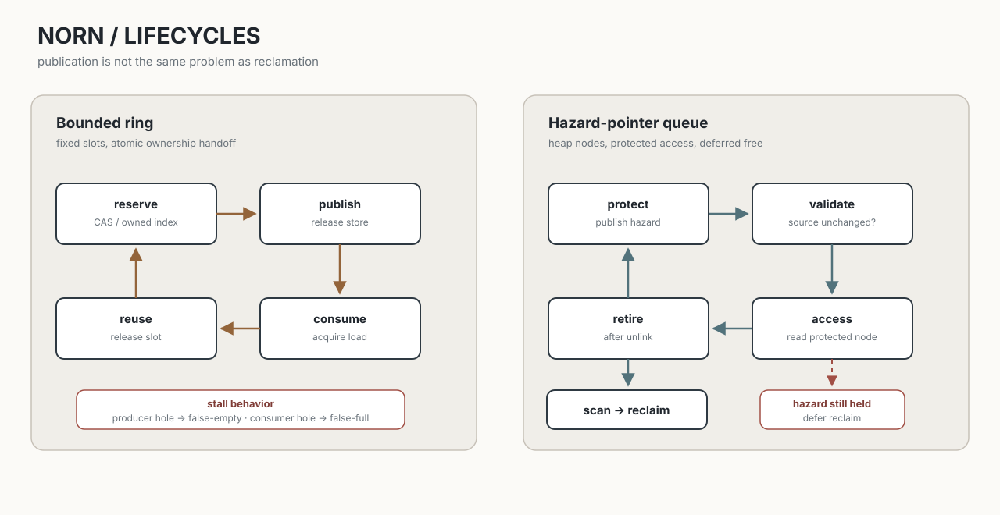

# Norn

[](https://github.com/wheevu/norn/actions/workflows/ci.yml)
[](LICENSE)

Norn is a C++20 concurrency lab for building, measuring, and explaining queues under the C++ memory model.

It starts with simple mutex-backed queues, moves through bounded SPSC and MPMC rings, and ends with an unbounded node-based queue that needs hazard-pointer reclamation.

Every step has tests, design notes, and an explanation of the tradeoffs.





## Build and test

Requirements:

- CMake 3.25 or newer.
- Make or Ninja.
- A C++20 compiler.

Build the default configuration and run the full test suite:

```sh
cmake --preset default
cmake --build --preset default
ctest --preset default --output-on-failure
```

Project warnings are errors by default for GCC and Clang:

```text
-Wall -Wextra -Wpedantic -Wconversion -Wshadow -Werror
```

Catch2 and Google Benchmark are fetched by CMake from pinned source archives with verified hashes.

### Sanitizers

The repository includes Debug, Release, ASan, UBSan, and TSan presets:

```sh
cmake --preset asan
cmake --build --preset asan
ctest --preset asan --output-on-failure

cmake --preset ubsan
cmake --build --preset ubsan
ctest --preset ubsan --output-on-failure

cmake --preset tsan
cmake --build --preset tsan
ctest --preset tsan --output-on-failure
```

GCC's ThreadSanitizer does not support `std::atomic_thread_fence` in this setup.
Apple Clang TSan and the other GCC sanitizer configurations are covered by the verification work.

## What Norn contains

| Structure | Thread model | Storage | What it shows |
| --- | --- | --- | --- |
| `mutex_queue<T>` | Multiple producers and consumers | `std::deque` | A simple reference implementation with close and drain semantics |
| `bounded_mutex_queue<T, N>` | Multiple producers and consumers | Fixed ring | A bounded locking baseline |
| `spsc_queue<T, N>` | One producer, one consumer | Pre-allocated ring | Ownership-based atomic publication |
| `spsc_queue_padded<T, N>` | One producer, one consumer | Pre-allocated ring | The cost and effect of cache-line separation |
| `mpmc_queue<T, N>` | Multiple producers and consumers | Pre-allocated ring | Sequence numbers, CAS reservation, and weak progress semantics |
| `mpsc_queue<T>` | Multiple producers, one consumer | Heap nodes | Hazard-pointer protection and deferred reclamation |

**Benchmark output (hardware campaign)**: per-sample `workers` array with per-thread `pushes`, `pops`, `retries`, `yields`, `spin_steps`, `producer_fairness`, `consumer_fairness`; campaign medians for all counter fields.

The bounded queues avoid individual node allocation and reclamation.
The hazard-pointer queue pays that cost deliberately so the lifetime problem is visible in code and tests.



## Baseline queue benchmarks

Measured on an Apple M1 with Apple Clang 21.0.0 at commit `5d73d0eb`, Release build, batch size 100,000 items.
Throughput is items per second from the harness; per-item cost is derived from the same value so the two columns agree.




| Structure | Configuration | ns/item | ops/s |
| --- | --- | --- | --- |
| Bounded mutex queue | single-thread push/pop | 68.1 | 14.68M |
| SPSC ring | unpadded | 73.3 | 13.64M |
| SPSC ring | padded (cache-line separated) | 59.5 | 16.81M |
| MPMC ring | 1x1 | 32.7 | 30.56M |
| MPMC ring | 2x2 | 152.7 | 6.55M |
| MPMC ring | 4x4 | 168.2 | 5.95M |
| Hazard-pointer queue | MPSC, 1x1 | 194.6 | 5.14M |

Build the Release benchmarks:

```sh
cmake --preset release
cmake --build --preset release
```

The main comparison binary includes the bounded mutex baseline, unpadded and padded SPSC queues, and the hazard-pointer queue:

```sh
python3 tools/run_benchmark.py \
  --binary build/release/norn_benchmarks \
  --output results/queue-comparison.json \
  --compiler c++ \
  --build-type Release
```

The bounded MPMC configurations have their own benchmark binary:

```sh
python3 tools/run_benchmark.py \
  --binary build/release/norn_mpmc_benchmarks \
  --output results/mpmc.json \
  --compiler c++ \
  --build-type Release
```

Thread creation, retry loops, and scheduler yields are part of the timed workload.
The numbers compare designs on this machine, not absolute cycles-per-operation claims.

The expected shape shows up: padded SPSC beats unpadded, consistent with the cache-line-separation hypothesis, and the hazard-pointer queue runs about 2.6x the unpadded SPSC ring per item because it allocates nodes and publishes hazard pointers on the pop path.
MPMC 1x1 is the fastest single-pair config; throughput drops as producer and consumer threads contend.

Full results and metadata in [docs/BENCHMARK_RESULTS.md](docs/BENCHMARK_RESULTS.md).

The legacy table measures the original harness and is not a universal hardware claim.

### Hardware campaign

The focused hardware campaign reruns the queues under a steady-state harness that excludes thread setup from the timed region, and adds Linux affinity read-back, retry and scheduler accounting, and safe `seq_cst` comparison cases.
The measurements come from the same machines, but the numbers are not directly comparable with the baseline table above.

Three findings worth reading first:

- **Steady-state MPMC 1x1 reaches about 134M ops/s** on both native M1 (133.99M) and the Linux ARM64 VM (135.10M), far above the baseline's 30.56M, because the steady-state harness does not time queue construction or thread creation.
- **The MPMC contention cliff is shared across environments**: 1x1 at ~134M drops to ~21.7M at 2x2 and ~6.5M at 4x4 tight.
Yielding or bounded/exponential backoff recovers part of the loss (4x4 yield reaches ~9.6M on M1).
- **Cache-line padding is not portable**: the M1 pilot favors padded SPSC (60.41M vs 31.32M unpadded), but the virtualized Linux ARM64 pilot reverses it (12.67M vs 22.28M unpadded).
Pinning both producer and consumer to one vCPU collapses padded SPSC to 0.17M, while distinct-core pinning recovers to 18.54M.

Read [docs/HARDWARE_PERFORMANCE.md](docs/HARDWARE_PERFORMANCE.md) for methodology, raw-result locations, the full pilot table, and caveats.

## Lifecycles



The ring buffers move through a small, fixed sequence of ownership states: reserve, publish, consume, and reuse.
The hazard-pointer queue adds a separate lifetime protocol: protect a node before reading it, validate the source, retire it after unlinking, and reclaim it only after a scan finds no active protection.

## Example

The SPSC queue has the smallest API:

```cpp
#include <norn/spsc_queue.hpp>

norn::spsc_queue<int, 1024> queue;

queue.try_push(42);

if (auto value = queue.try_pop()) {
  // consume *value
}
```

The SPSC contract is strict: exactly one thread owns producer operations and exactly one thread owns consumer operations.
Use `mpmc_queue` or a mutex-backed queue when that ownership model does not fit.

## Important distinctions

### SPSC ring buffer

The producer owns the write index and the consumer owns the read index.
Each side publishes progress with release stores and observes the other side with acquire loads.
Values live in pre-allocated slots, and the queue manages object lifetimes explicitly.

### MPMC ring buffer

The bounded MPMC queue uses per-slot sequence numbers and CAS-based reservation.
A sequence number tells a producer when a slot can be reused and tells a consumer when a value is published.

The queue is mutex-free and non-blocking, but it is **not formally lock-free**.
A producer paused after reserving a slot can create a false-empty hole.
A consumer paused after claiming a slot can create a false-full result.
These behaviors are intentional, documented, and tested.

### Hazard pointers

Hazard pointers protect dynamically allocated nodes while a thread is reading them.
The reader publishes a pointer, validates that the shared pointer has not changed, and clears the protection when finished.
A retired node is reclaimed only after a scan finds no active hazard pointer for it.

The hazard-pointer demonstration is MPSC rather than MPMC.
That keeps the reclamation example focused while the bounded MPMC ring covers the many-to-many case.

## Verification

The current suite contains 37 tests covering:

- Mutex queue behavior, close-and-drain semantics, and bounded capacity.
- SPSC boundaries, wraparound, move-only values, and two-thread transfer.
- MPMC boundaries, wraparound, exactly-once consumption, and progress holes.
- Parameterized MPMC and SPSC stress histories.
- Hazard-pointer publication, registration, reclamation, move-only values, and queue stress.

**Hardware campaign evidence** (CTest `hardware_campaign_tool` and `hardware_binary_json_contract`):
- Per-worker retry, yield, spin-step, and fairness counts in every sample.
- Full MPMC unpinned matrix: 1x1/2x2/4x4 × tight/yield/bounded/exponential backoff (1M items each).
- Campaign summary medians for retries, yields, spin steps, producer/consumer fairness.
- Multi-worker pinned cases guarded against misleading distinct-core placement.
- Binary JSON contract test validating output shape, sample completeness, and worker-aggregate reconciliation.

The project has been verified with:

| Environment | Toolchain | Coverage |
| --- | --- | --- |
| macOS ARM64 | Apple Clang 21 | Default, Release, ASan, UBSan, TSan |
| Ubuntu ARM64 in Lima | GNU GCC 13.3 | Default, Release, ASan, UBSan |
| Ubuntu x86-64 in GitHub Actions | GCC and Clang | Debug/Release matrix and Clang sanitizers |

GitHub Actions runs the native x86-64 build matrix and sanitizer jobs.
Local Linux verification uses a disposable ARM64 Lima copy of the source tree.

## Documentation

- [`docs/ARCHITECTURE.md`](docs/ARCHITECTURE.md): milestone scope and project boundaries.
- [`docs/ARCHITECTURE_WRITEUP.md`](docs/ARCHITECTURE_WRITEUP.md): the complete architecture and performance overview.
- [`docs/MPMC_DESIGN.md`](docs/MPMC_DESIGN.md): slot states, reservations, memory orders, and progress limits.
- [`docs/HAZARD_POINTER_DESIGN.md`](docs/HAZARD_POINTER_DESIGN.md): publication, scanning, ABA, and reclamation.
- [`docs/CORRECTNESS_CAMPAIGN.md`](docs/CORRECTNESS_CAMPAIGN.md): parameterized histories, progress demonstrations, and results.
- [`docs/MEMORY_MODEL.md`](docs/MEMORY_MODEL.md): synchronization and linearization notes.
- [`docs/BENCHMARKING.md`](docs/BENCHMARKING.md): benchmark methodology and caveats.
- [`docs/BENCHMARK_RESULTS.md`](docs/BENCHMARK_RESULTS.md): measured metrics and environment.
- [`docs/HARDWARE_PERFORMANCE.md`](docs/HARDWARE_PERFORMANCE.md): affinity, false sharing, contention, backoff, ordering, and counter evidence (includes per-worker statistics and full backoff matrix).
- [`docs/INTERVIEW_NOTES.md`](docs/INTERVIEW_NOTES.md): questions grounded in the implementation.

## Limitations

- `mpmc_queue` is not formally lock-free despite using atomics and no mutex.
- The hazard-pointer demonstration is MPSC, not MPMC.
- Benchmark setup is part of the timed workload.
- Native x86-64 verification comes from GitHub Actions; local Linux verification is ARM64.
- The Linux ARM64 hardware pilot is virtualized, and GitHub Actions is a functional smoke gate rather than a performance environment.
- This is an educational concurrency project, not a drop-in production queue library.

## License

Norn is released under the [MIT License](LICENSE).
